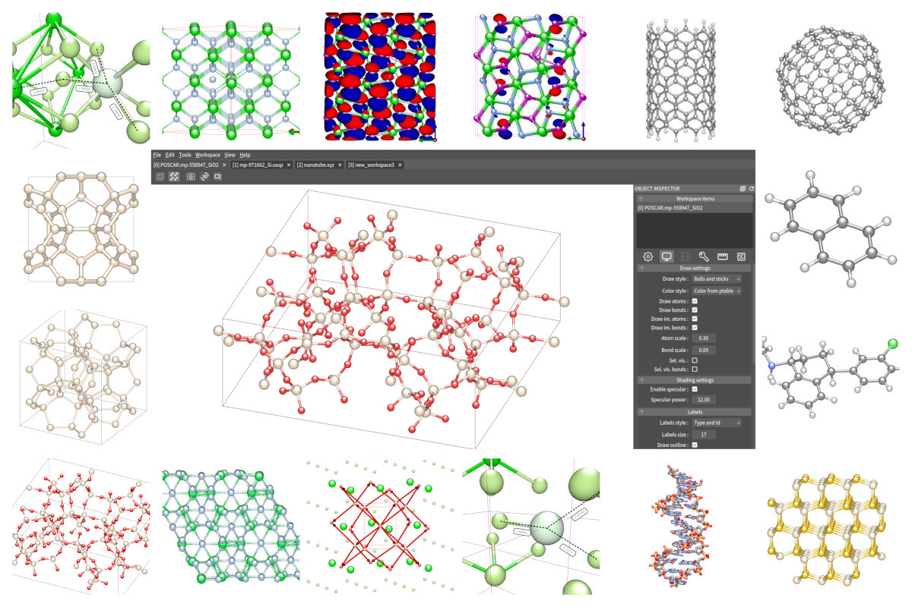

Welcome to qpp::cad's documentation!
====================================

**qpp::cad** is the molecule and crystal editor written in c++.

Source code can be obtained from https://github.com/nvpopov/qppcad

This documentation divided into three parts:

#. **qpp::cad** - Documentation for visualization program
#. **qpp** - Documentation for c++ framework for computational chemistry
#. **pyqpp** - Documentation for python bindings for qpp

.. toctree::
   :maxdepth: 2
   :caption: Contents:

   qppcad
   qpp
   pyqpp

Indices and tables
==================

* :ref:`genindex`
* :ref:`modindex`
* :ref:`search`
